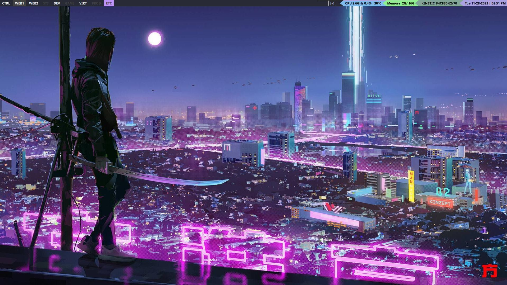

# dotfiles
My Linux Dotfiles

|My Setup|
|-------|
|**OS:** Arch Linux|
|**Windows Manager:** Qtile|
|**Terminal Emulator:** Alacritty|
|**Shell:** ZSH (oh-my-zsh)|
|**Compositor:** Picom|
|**Text Editor:** Vim|
|**GUI File Manager:** Thunar|
|**CLI File Manager:** Ranger|
|**Screenshot Program:** Maim|
